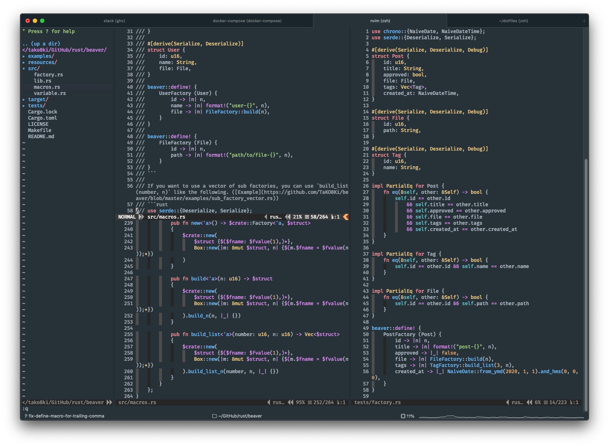

# TaKO8Ki's dotfiles
## Appearance

[

## Usage

```sh
./install.sh
```

## Setup

```sh
$ curl -L https://raw.github.com/robbyrussell/oh-my-zsh/master/tools/install.sh | sh
$ chsh -s /bin/zsh
$ echo $SHELL
```

あとはここ見ろ。https://qiita.com/NaokiIshimura/items/249bb1a101b626a59387
